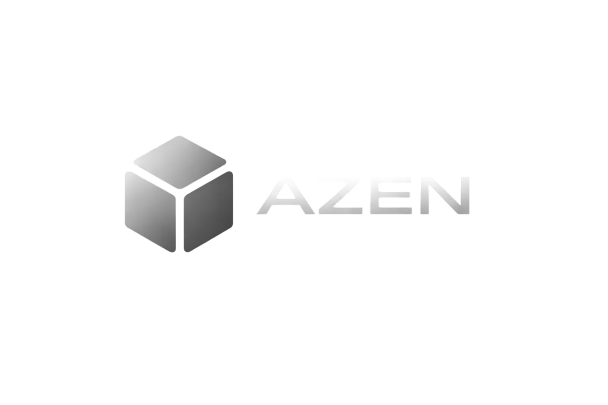

<div align="center">

<br />



### Memory infrastructure for AI agents

<p>
  <a href="https://github.com/govindvashishat/azen-sh/blob/main/LICENSE">
    
  </a>
  <a href="https://bun.sh">
    
  </a>
  
  
</p>

<p>
  <b>Self-hostable · Provider-agnostic · Graph-aware · Semantically searchable</b>
</p>

</div>

---

**Azen** is an open-source memory layer you can drop into any AI application. Store, retrieve, and search memories across conversations using vector similarity, graph traversal, and full-text search — all from a single REST API.

> Think of it as a long-term memory backend for your agents: persistent, structured, and queryable.

<br />

## Architecture

```
┌─────────────────────────────────────────────────────────────┐
│                        Your Application                      │
│                       REST API                               │
└───────────────────────────┬─────────────────────────────────┘
                            │
┌───────────────────────────▼─────────────────────────────────┐
│                      Azen API Server                         │
│                    (Hono · TypeScript)                       │
└──────────┬──────────────────────────┬───────────────────────┘
           │                          │
┌──────────▼──────────┐   ┌───────────▼────────────────────────┐
│    Core Engine       │   │         Embedding Providers         │
│  MemoryService       │   │  OpenAI · Custom (OpenAI-compatible) │
│  SearchService       │   └────────────────────────────────────┘
└──┬───────┬───────┬──┘
   │       │       │
   ▼       ▼       ▼
┌──────┐ ┌──────┐ ┌──────────────────┐
│  PG  │ │Neo4j │ │  Vector Store     │
│(SQL) │ │(Graph│ │  pgvector/Qdrant  │
└──────┘ └──────┘ └──────────────────┘
```

Every memory write fans out to three stores simultaneously:
- **PostgreSQL** — canonical record with full metadata
- **Vector store** — embedding for semantic nearest-neighbor search
- **Neo4j** — graph node for relationship traversal

<br />

## Features

| | |
|---|---|
| **Semantic search** | Query memories by meaning, not keywords, using vector embeddings |
| **Graph-aware** | Traverse relationships between memories up to arbitrary depth with Neo4j |
| **Multi-provider embeddings** | OpenAI, or any OpenAI-compatible endpoint |
| **Pluggable vector stores** | pgvector (zero extra infra) or Qdrant (high-scale) |
| **Self-hostable** | Full Docker Compose stack — no cloud dependency |
| **Per-app namespacing** | Scope memories by `userId` + `appId` for multi-tenant use cases |
| **TTL support** | Set `expiresAt` on any memory for automatic expiry |

<br />

## Self-Hosting

### Production (Docker Compose)

The recommended way to run Azen. Builds the server image and starts all services in one command.

**1. Clone the repo**

```bash
git clone https://github.com/govindvashishat/azen-sh
cd azen-sh
```

**2. Configure environment**

```bash
cp .env.example .env
```

Edit `.env` and fill in the required values:

```env
# Required
POSTGRES_PASSWORD=your_secure_password
NEO4J_PASSWORD=your_secure_password
OPENAI_API_KEY=sk-...

# Optional — defaults shown
POSTGRES_DB=azen
POSTGRES_USER=postgres
NEO4J_USER=neo4j
VECTOR_STORE=pgvector          # pgvector | qdrant
COMPOSE_PROFILES=              # set to match VECTOR_STORE if not pgvector (e.g. qdrant)
EMBEDDING_MODEL=text-embedding-3-small
PORT=3000
LOG_LEVEL=info
```

**3. Start everything**

```bash
docker compose up -d
```

This builds the server image and starts PostgreSQL (with pgvector), Neo4j, Redis, Qdrant, and the API server. The server waits for PostgreSQL and Neo4j to be healthy before starting.

The API is live at `http://localhost:3000`.

Services also exposed locally:
- PostgreSQL → `localhost:5432`
- Neo4j browser → `localhost:7474`
- Qdrant → `localhost:6333`

<br />

## API Reference

### Add a memory

```http
POST /memories
Content-Type: application/json

{
  "userId": "user_123",
  "appId": "my-chatbot",
  "content": "The user prefers concise responses and dislikes bullet points.",
  "metadata": { "source": "conversation", "turn": 42 }
}
```

```json
{
  "id": "mem_01jk...",
  "userId": "user_123",
  "appId": "my-chatbot",
  "content": "The user prefers concise responses and dislikes bullet points.",
  "metadata": { "source": "conversation", "turn": 42 },
  "createdAt": "2026-02-28T10:00:00.000Z",
  "updatedAt": "2026-02-28T10:00:00.000Z"
}
```

### Semantic search

```http
GET /search?userId=user_123&appId=my-chatbot&query=user+communication+style&topK=5
```

```json
[
  {
    "memory": { "id": "mem_01jk...", "content": "..." },
    "score": 0.94
  }
]
```

### List memories

```http
GET /memories?userId=user_123&appId=my-chatbot
```

### Update a memory

```http
PATCH /memories/:id
Content-Type: application/json

{
  "content": "Updated content."
}
```

### Delete a memory

```http
DELETE /memories/:id
```

### Delete all memories for a user

```http
DELETE /memories?userId=user_123&appId=my-chatbot
```

### Health check

```http
GET /health
```

<br />

## MCP Integration

Connect Azen directly to AI tools like Claude Desktop, Cursor, or any MCP-compatible client. The MCP server exposes memory tools over stdio — the AI can store, search, list, and delete memories without you writing any API calls.

**1. Add to your Claude Desktop config** (`claude_desktop_config.json`):

```json
{
  "mcpServers": {
    "azen": {
      "command": "/path/to/bun",
      "args": ["run", "/path/to/azen-sh/packages/mcp/index.ts"],
      "env": {
        "AZEN_URL": "http://localhost:3000"
      }
    }
  }
}
```

> Replace `/path/to/bun` with the output of `which bun`, and update the path to your Azen repo.

**2. Restart Claude Desktop.** The MCP server starts automatically.

**Available tools:**

| Tool | Description |
|---|---|
| `add_memory` | Store a new memory |
| `search_memories` | Semantically search stored memories |
| `list_memories` | List all memories for a user |
| `delete_memory` | Delete a memory by ID |

The MCP server requires your Azen API to be running (`docker compose up`).

<br />

## Embedding Providers

| Provider | Notes |
|---|---|
| OpenAI | Requires `OPENAI_API_KEY`. Default model: `text-embedding-3-small`. |
| Custom | Any OpenAI-compatible endpoint via `EMBEDDING_BASE_URL`. |

<br />

## Vector Stores

| Store | `VECTOR_STORE` | Notes |
|---|---|---|
| pgvector | `pgvector` | Built into PostgreSQL. Zero extra infra. |
| Qdrant | `qdrant` | Standalone vector database. Better for large-scale workloads. |

<br />

## Monorepo Structure

```
azen-sh/
├── server/              # Hono REST API server
├── core/                # Core engine
│   ├── memories/        # MemoryService — CRUD + fan-out writes
│   ├── search/          # SearchService — semantic retrieval
│   ├── embed/           # Embedding provider abstraction
│   ├── vectors/         # Vector store abstraction (pgvector, Qdrant)
│   ├── graph/           # Neo4j client + graph operations
│   └── db/              # Drizzle ORM schema + migrations
├── packages/
│   ├── types/           # Shared Zod schemas and TypeScript types
│   └── mcp/             # MCP server for AI tool integration
├── tests/               # Schema validation + route handler tests
├── docker/              # Init scripts for Postgres and Neo4j
└── .github/workflows/   # CI pipeline (typecheck, test, build)
```

<br />

## Contributing

Contributions are welcome! See [CONTRIBUTING.md](./CONTRIBUTING.md) for setup instructions and guidelines.

CI runs on every PR — typecheck, tests, and build must pass before merging.

<br />

## License

[MIT](./LICENSE)

---

<div align="center">
  <sub>Built with <a href="https://bun.sh">Bun</a> · Powered by pgvector, Neo4j, and Qdrant</sub>
</div>
